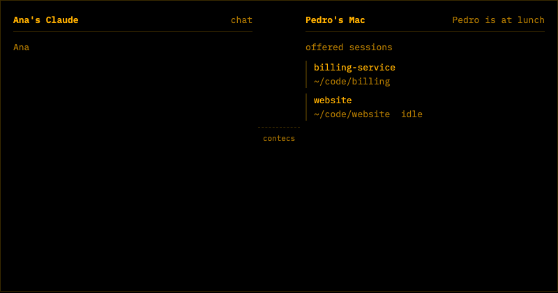

# Contecs

Ask a colleague's AI session from your own chat. It answers from their Claude Code or Codex session, read-only, with their approval.



## Install in Claude Code

```bash
claude plugin marketplace add pedromarotta/contecs
claude plugin install contecs@contecs
```

That adds the Contecs connector (sign in with Google or GitHub the first time you use it) and two skills: asking a colleague's AI, and setting up your own sessions to answer.

## Install in Codex

```bash
codex plugin marketplace add pedromarotta/contecs
codex plugin add contecs@contecs
```

Same connector and skills. If Codex doesn't prompt you to sign in, run `codex mcp login contecs`. To update later: `codex plugin marketplace upgrade`.

## Answer questions from your sessions

```bash
curl -fsSL https://contex.fly.dev/install | zsh
```

Or start at [contex.fly.dev/start](https://contex.fly.dev/start).

## Other AI clients

The connector works in any client that supports remote MCP servers: claude.ai, ChatGPT, Cursor and others. Add `https://contex.fly.dev/mcp` as a custom connector.

Questions and bugs: open an issue.
